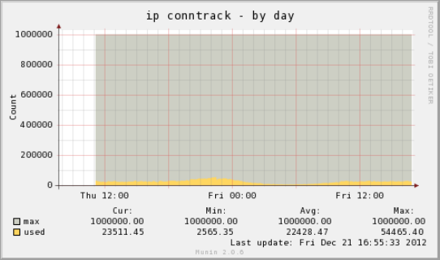

#Munin ip_conntrack check plugin

<pre><code>
</code></pre>
* * *
##INSTALLATION

###1. get the file
<pre><code>
# cd /usr/share/munin/plugins/
# wget https://raw.github.com/S1100/munin-plugin-ip_conntrack/master/ip_conntrack
# chmod 755 ip_conntrack
# cd /etc/munin/plugins
# ln -s /usr/share/munin/plugins/ip_conntrack .

</code></pre>

###2. check the response
<pre><code>
$ time /etc/munin/plugins/ip_conntrack 
ip_conntrack OK - table usage = 0.1%, count = 75
max_ip_conntrack.value 65536
used_ip_conntrack.value 61

real    0m0.040s
user    0m0.018s
sys     0m0.020s
</code></pre>
If your server needs over 5 second, should not to use this plugin.

###3. allow munin-node user to count ip_conntrack
This plugin must run with root privileges
<pre><code>
# vi /etc/munin/plugin-conf.d/munin-node
--- add
[ip_conntrack]
user root
---
# service munin-node restart
# munin-run ip_conntrack 
</code></pre>
